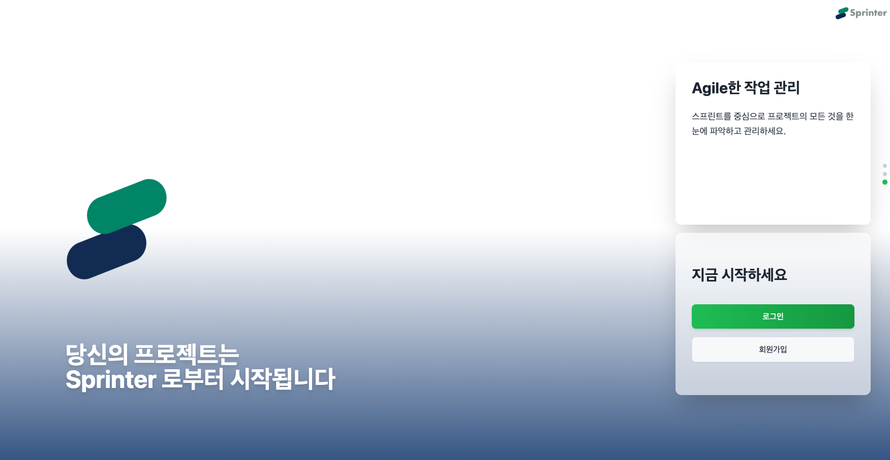
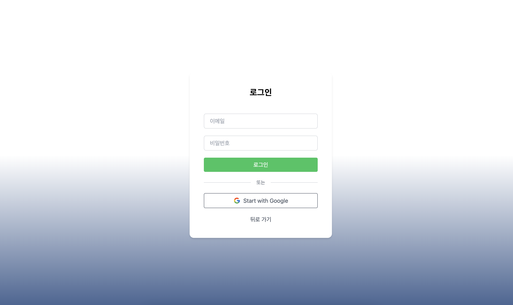
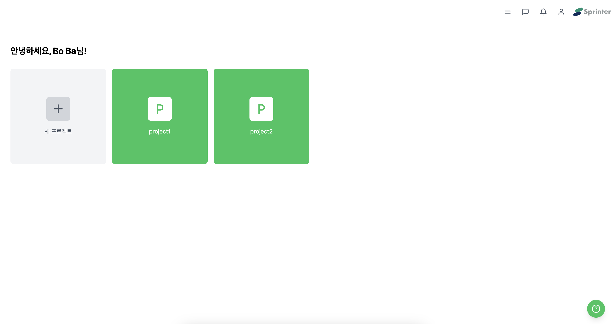
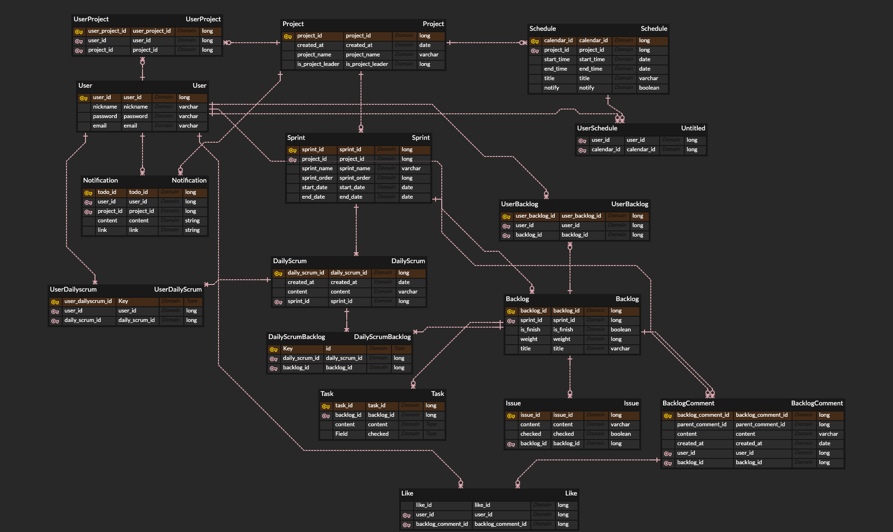

### SPRINTER - 온라인 협업 툴

  <h1>SPRINTER</h1>
  
애자일 방법을 적용한 협업 서비스

 

  

  <a href="https://sprinter.kr/">홈페이지 링크</a>

---

## 🧑‍💻 팀원 소개

| **이름**    | **역할**        | 
|:-----------:|:---------------:|
| [고경태](https://github.com/kraftenty)      | 팀장 & FE/BE    | 
| [현준혁](https://github.com/HYH0804)      | BE           |
| [소보길](https://github.com/sobogil)      |  BE             | 

---

## ⚙️ 기술 스택

<table>
  <thead>
    <tr>
      <th>분류</th>
      <th>기술 스택</th>
    </tr>
  </thead>
  <tbody>
    <tr>
      <td>프론트엔드</td>
      <td>
        
        
      </td>
    </tr>
    <tr>
      <td>백엔드</td>
      <td>
        
        
        
      </td>
    </tr>
    <tr>
      <td>데이터베이스</td>
      <td>
        
      </td>
    </tr>
    <tr>
      <td>인프라</td>
      <td>
        
        
        
      </td>
    </tr>
  </tbody>
</table>

---

# 🔍 [목차](#index) 

- [프로젝트 개요](#outline)
- [아키텍처](#structure)
- [프로젝트 결과](#outputs)
- [협업 방식 - Trello,Notion](#work)
- [ERD](#erd)  
- [테스트 및 모니터링](#test)
- [기술 선택의 이유](#why)
- [리팩토링 & 성능 개선](#refactoring)
- [성과 및 회고](#retrospection)

 

# 📝 프로젝트 개요 

   
 자세히 보기 (🔽 Click)

 

•	현대의 비즈니스 환경은 점점 더 빠르고 복잡해지면서 팀 간의 협업과 작업 관리가 필수 요소로 자리 잡고 있다. 특히, 원격 근무가 증가하고 다수의 프로젝트를 동시에 진행해야 하는 상황이 많아지면서, 작업의 우선순위 관리와 팀원 간의 원활한 커뮤니케이션이 중요한 도전 과제가 되었다.

•	본 프로젝트는 이러한 문제점을 해결하고, 사용자가 더 쉽게 적응하고 효율적으로 사용할 수 있는 도구를 개발하고자 한다. 이를 위해 단순한 작업 관리 기능 뿐만 아니라 팀원 간의 실시간 소통, 목표 달성 트래킹 시각화, 역할 기반 권한 관리, 애자일 방법론 적용 등을 포함하는 종합적인 솔루션을 제공하는 것을 목표로 한다.

•	애자일 기반의 소프트웨어 공학적 방법론을 기반으로 프로젝트를 관리하며, ChatGPT API를 적용하여 복잡한 프로젝트의 편리한 생성을 도모한다.

 

# 📈 아키텍처  

   
 자세히 보기 (🔽 Click)

 

 

# 🏆 프로젝트 결과  

   
 자세히 보기 (🔽 Click)

 

### login 페이지

 

 

### home 페이지

 

 

 

# 🏗️ 협업 방식  

   
 자세히 보기 (🔽 Click)

 

 

# 🗂️ ERD 

   
 자세히 보기 (🔽 Click)

 

 

 

# 🧪 테스트 및 모니터링 

   
 자세히 보기 (🔽 Click)

 

 

# 🧠 기술 선택의 이유 

   
 자세히 보기 (🔽 Click)

 

 

# 🧹 리팩토링 & 성능 개선 

   
 자세히 보기 (🔽 Click)

 

 

# 💬 성과 및 회고 

   
 자세히 보기 (🔽 Click)

 

 

## 📂 문서 자료

- [보고서](https://github.com/sprinter/...~~~~)
