### SPRINTER - 온라인 협업 툴

  <h1>SPRINTER</h1>
  
애자일 방법을 적용한 협업 서비스

 

  

  <a href="https://sprinter.kr/">홈페이지 링크</a>

---

## 🧑‍💻 팀원 소개

| **이름**    | **역할**        | 
|:-----------:|:---------------:|
| [고경태](https://github.com/kraftenty)      | 팀장 & FE/BE    | 
| [현준혁](https://github.com/HYH0804)      | BE           |
| [소보길](https://github.com/sobogil)      |  BE             | 

---

## ⚙️ 기술 스택

<table>
  <thead>
    <tr>
      <th>분류</th>
      <th>기술 스택</th>
    </tr>
  </thead>
  <tbody>
    <tr>
      <td>프론트엔드</td>
      <td>
        
        
      </td>
    </tr>
    <tr>
      <td>백엔드</td>
      <td>
        
        
        
      </td>
    </tr>
    <tr>
      <td>데이터베이스</td>
      <td>
        
      </td>
    </tr>
    <tr>
      <td>인프라</td>
      <td>
        
        
        
      </td>
    </tr>
  </tbody>
</table>

---

# 🔍 [목차](#index) 

- [프로젝트 개요](#outline)
- [아키텍처](#structure)
- [주요 기능](#outputs)
- [협업 방식 - Trello,Notion](#work)
- [ERD](#erd)  
- [테스트 및 모니터링](#test)
- [리팩토링 & 성능 개선](#refactoring)
- [성과 및 회고](#retrospection)

 

# 📝 프로젝트 개요 

   
 자세히 보기 (🔽 Click)

 

•	현대의 비즈니스 환경은 점점 더 빠르고 복잡해지면서 팀 간의 협업과 작업 관리가 필수 요소로 자리 잡고 있다. 특히, 원격 근무가 증가하고 다수의 프로젝트를 동시에 진행해야 하는 상황이 많아지면서, 작업의 우선순위 관리와 팀원 간의 원활한 커뮤니케이션이 중요한 도전 과제가 되었다.

•	본 프로젝트는 이러한 문제점을 해결하고, 사용자가 더 쉽게 적응하고 효율적으로 사용할 수 있는 도구를 개발하고자 한다. 이를 위해 단순한 작업 관리 기능 뿐만 아니라 팀원 간의 실시간 소통, 목표 달성 트래킹 시각화, 역할 기반 권한 관리, 애자일 방법론 적용 등을 포함하는 종합적인 솔루션을 제공하는 것을 목표로 한다.

•	애자일 기반의 소프트웨어 공학적 방법론을 기반으로 프로젝트를 관리하며, ChatGPT API를 적용하여 복잡한 프로젝트의 편리한 생성을 도모한다.

 

# 📈 아키텍처  

   
 자세히 보기 (🔽 Click)

 

 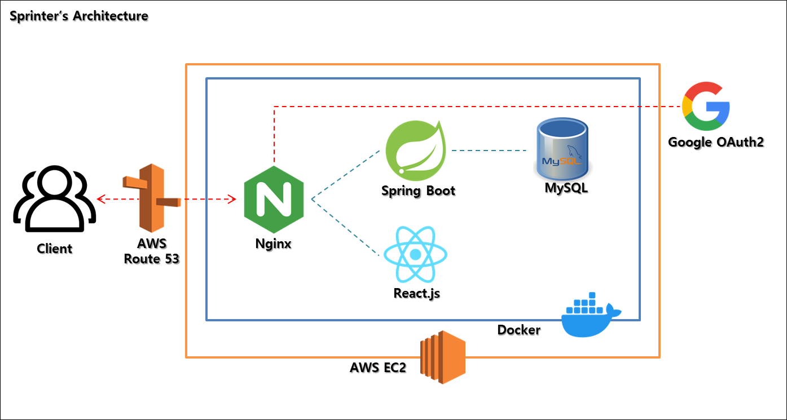

 

# 🏆 주요 기능  

   
 자세히 보기 (🔽 Click)

 

### login 페이지

 

 

### home 페이지

 

### 도움말 페이지

 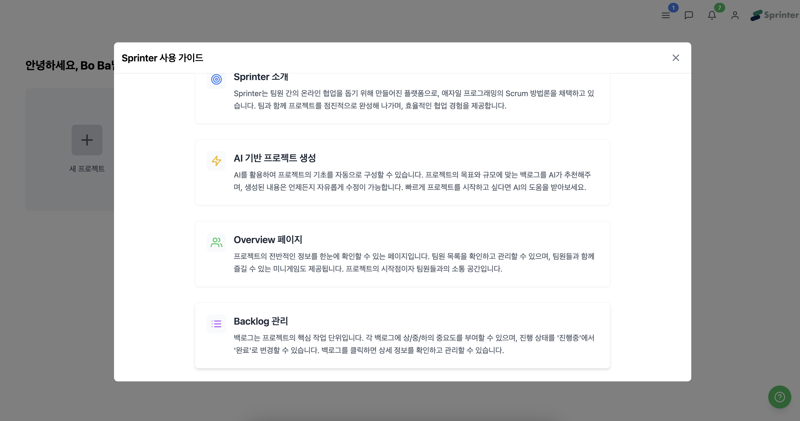

 

 

### 프로젝트 생성 페이지

 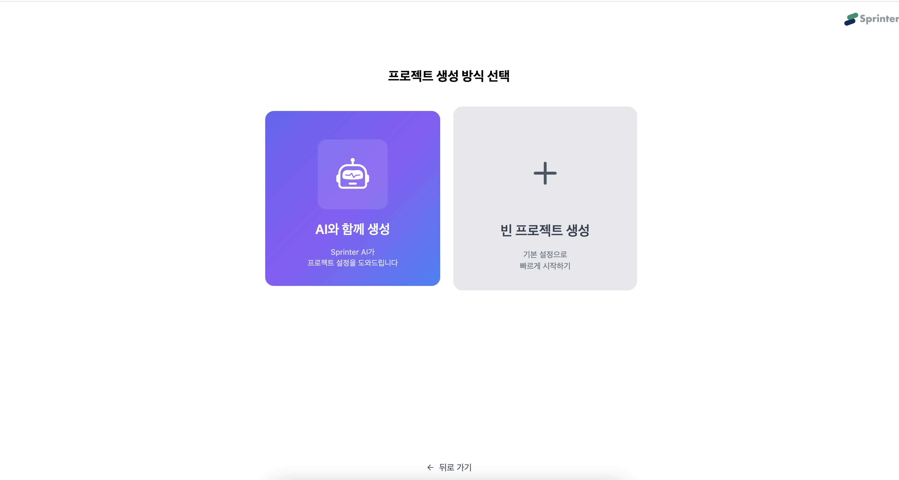
 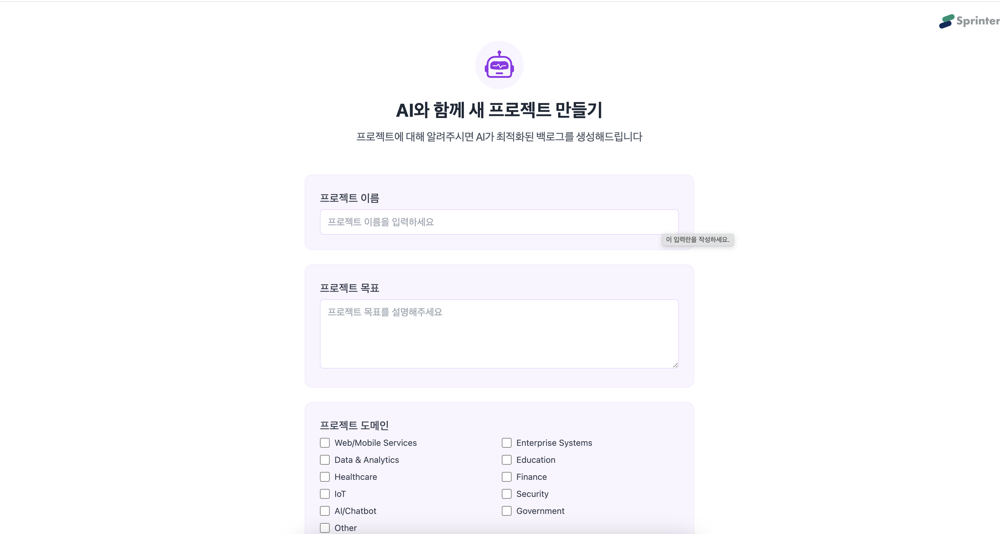
 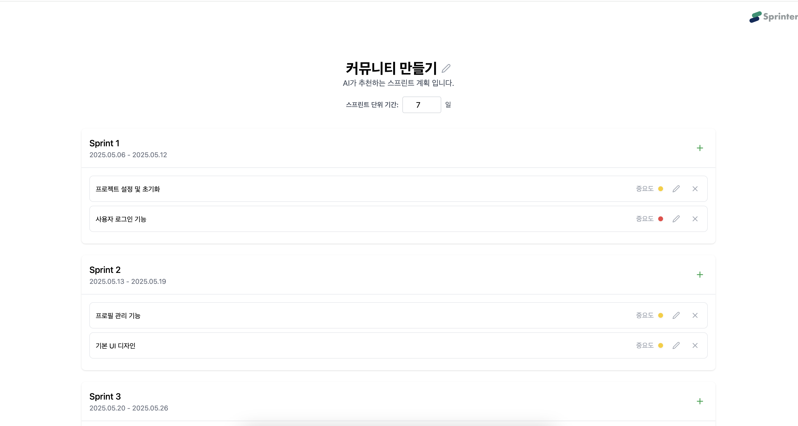

 

### overview 페이지

 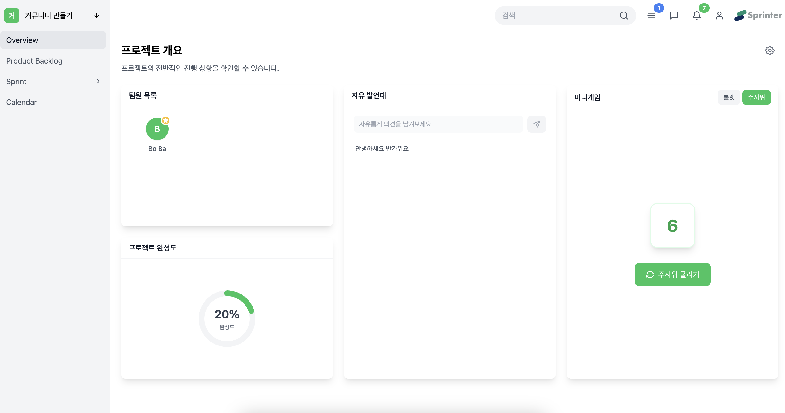

 

### product backlog 페이지

 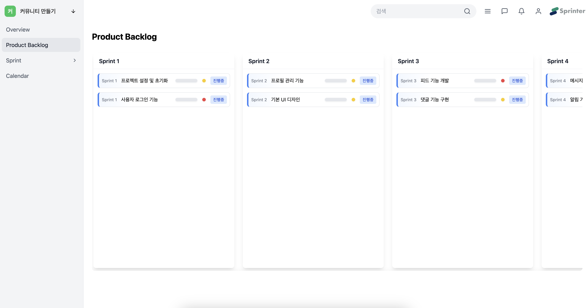

 

### sprint 페이지

 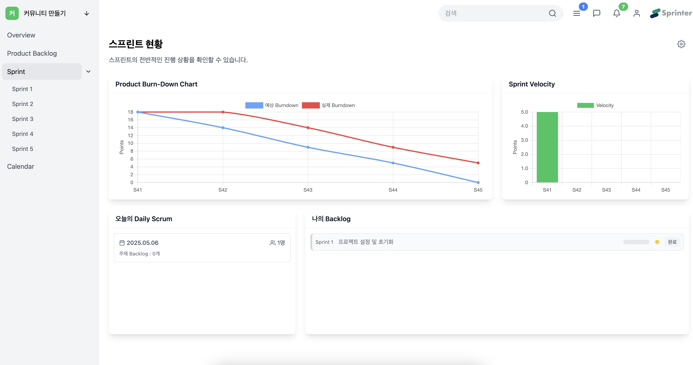

번다운 차트 기용 ... ... 
 

### sprint 상세 페이지

 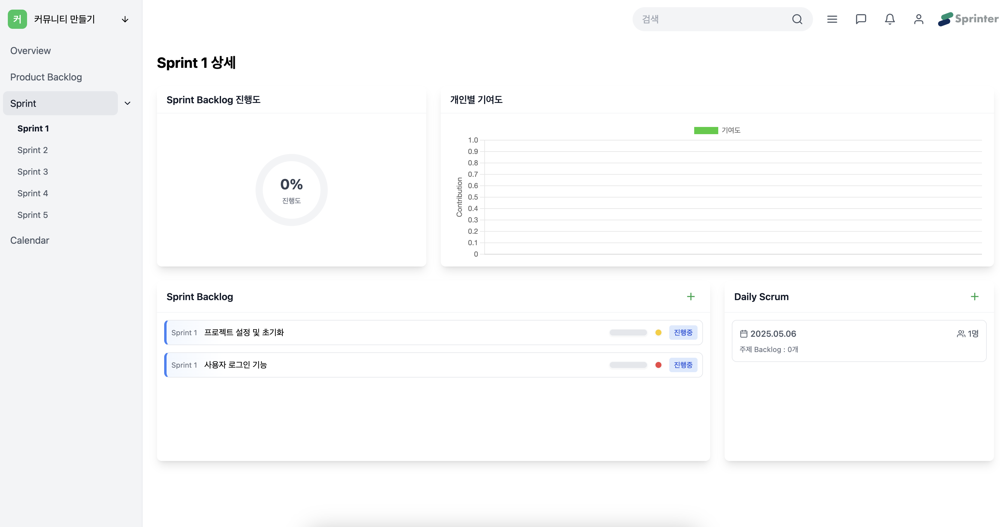

설명

 

### backlog 페이지

 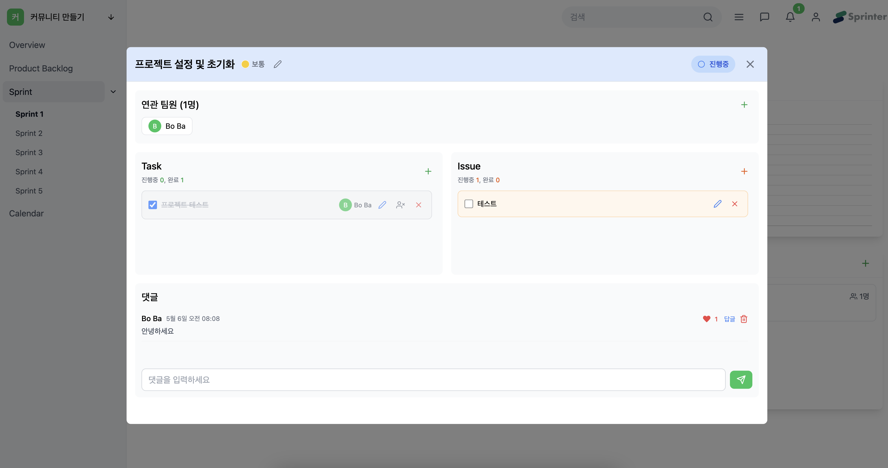

(issue와 task ... 설명추가)
 

### 검색 페이지

 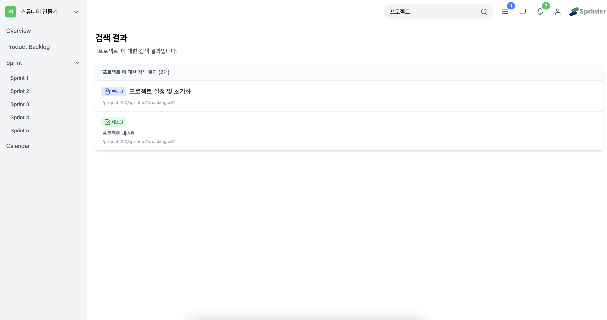

 

### 캘린더 페이지

 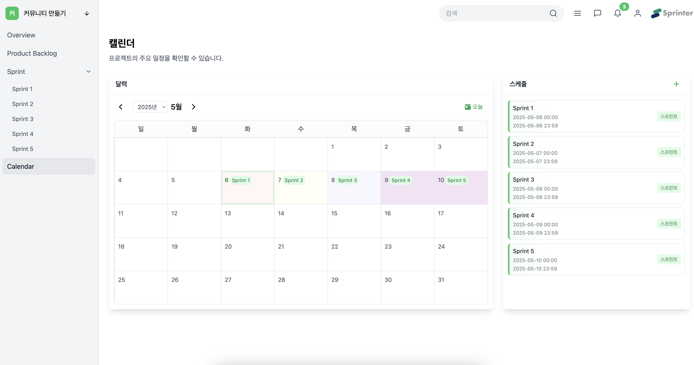
 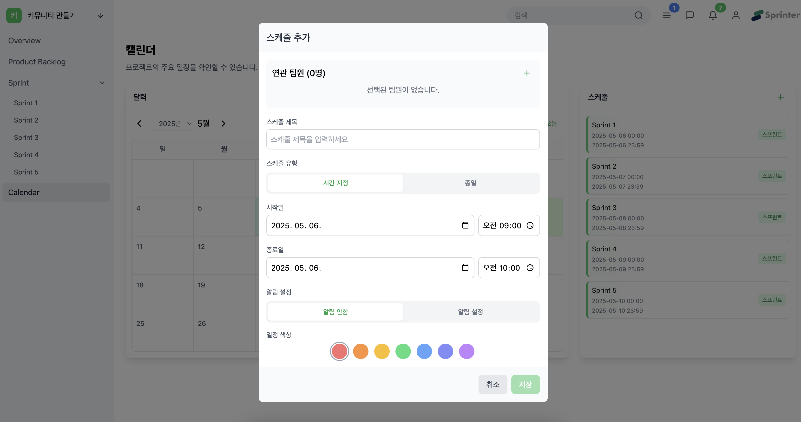

 

### 상단바 메뉴

 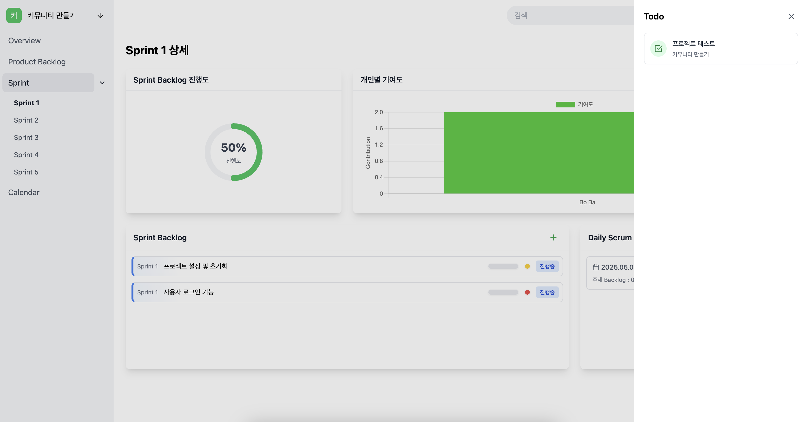
 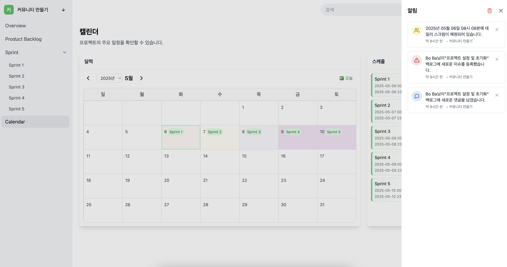
 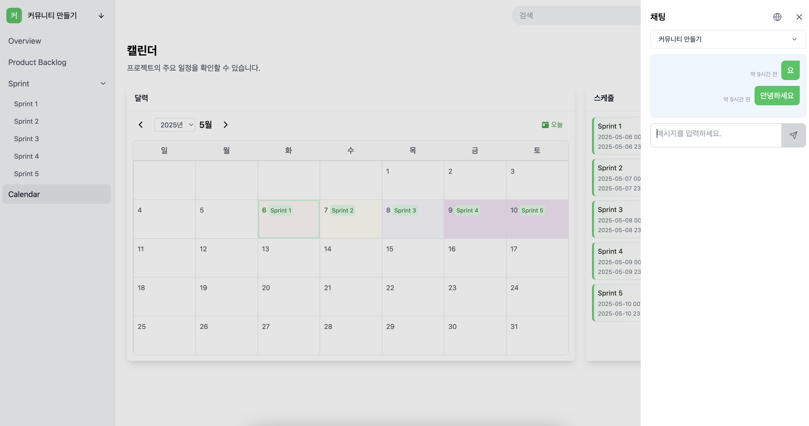

 

### 세팅 페이지

 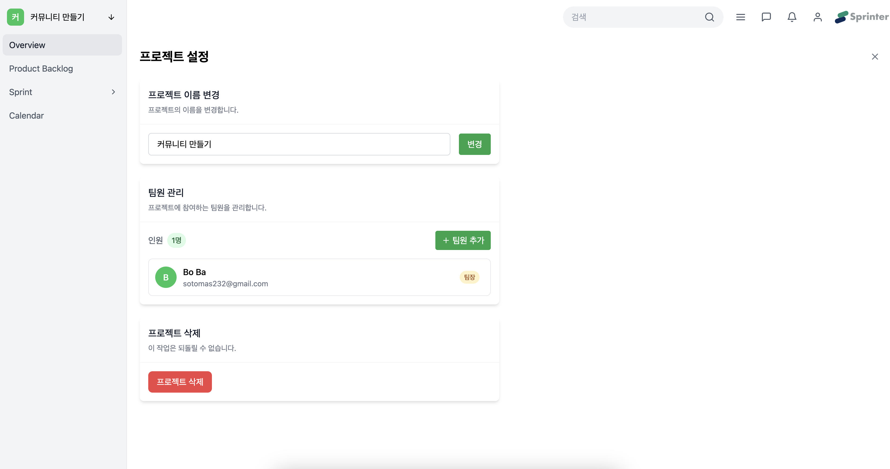

 

 

# 🏗️ 협업 방식  

   
 자세히 보기 (🔽 Click)

 

 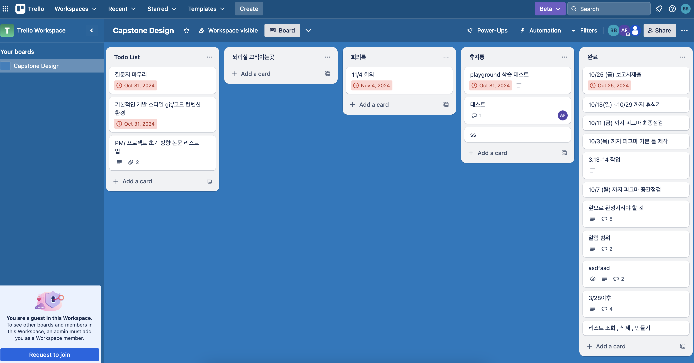

저희 팀은 Trello를 활용하여 회의 중 논의된 내용과 작업 항목들을 정리하였고, 이를 칸반보드 형태로 시각화하여 업무 진행 상황을 한눈에 파악할 수 있도록 관리했습니다.

 

# 🗂️ ERD 

   
 자세히 보기 (🔽 Click)

 

 

🧩 전체 구조 요약

1. 👤 사용자(User) 관련  
	•	User: 사용자의 기본 정보 (닉네임, 비밀번호, 이메일)  
	•	Like: 댓글에 대한 좋아요 기능 구현  
  ---
2. 📁 프로젝트(Project)   
	•	Project: 프로젝트의 정보 (이름, 생성일, 팀장 여부 등)  
	•	Schedule, Sprint를 통해 세부 일정 및 작업과 연결  
  ---
3. 📅 일정(Schedule)  
	•	Schedule: 프로젝트 내 일정 항목 (제목, 시작/종료 시간, 알림 여부)  
	•	UserSchedule: 일정을 함께 하는 사용자들과의 관계  
  ---
4. 🌀 스프린트(Sprint)  
	•	Sprint: 특정 프로젝트의 반복 주기 단위 (이름, 순서, 시작/종료일)  
	•	하나의 Project에 여러 Sprint가 연결됨  
	•	DailyScrum, Backlog와 연결됨  
  ---
5. 📋 백로그(Backlog)  
	•	Backlog: 작업 항목 (제목, 무게, 완료 여부 등)  
	•	Sprint에 속함  
	•	Task, Issue, Comment, Like와 연결되어 세부적인 관리 가능  
  ---
6. ✅ 태스크(Task) & 이슈(Issue)  
	•	Task: 백로그의 세부 작업 항목  
	•	Issue: 백로그의 문제점/이슈를 별도로 관리  
  ---
7. 💬 댓글(BacklogComment)  
	•	BacklogComment: 백로그에 대한 댓글 시스템  
	•	parent_comment_id를 이용한 대댓글 구조 가능  
	•	Like와 연결되어 좋아요 기능 구현  
  ---
8. 📌 데일리 스크럼(DailyScrum)  
	•	DailyScrum: 매일 회고나 공유를 위한 간단한 작성 기능  
  ---
9. 🔔 알림(Notification)  
	•	Notification: 특정 사용자에게 특정 프로젝트/작업과 관련된 알림 제공  
	•	예: “새로운 댓글이 달렸습니다”, “업무가 할당되었습니다”  
  ---
10. 🧠 중간테이블  
	•	UserProject: 어떤 사용자가 어떤 프로젝트에 속해 있는지  
	•	UserSchedule: 사용자와 일정의 관계  
	•	UserDailyScrum / UserBacklog: 사용자의 데일리 스크럼 및 백로그 참여 정보  
	•	UserProject를 통해 사용자들과 연결됨  
	•	UserBacklog: 어떤 사용자가 어떤 백로그에 참여했는지  
	•	UserDailyScrum: 데일리 스크럼에 참여한 사용자들  
	•	DailyScrumBacklog: 데일리 스크럼과 백로그 연결 (오늘 어떤 일 했는지   표현 가능)  

 

# 🧪 테스트 및 모니터링 

   
 자세히 보기 (🔽 Click)

 

여기는 테스트 후에 작성

 

# 🧹 리팩토링 & 성능 개선 

   
 자세히 보기 (🔽 Click)

 
여기는 리팩토링과 성능개선 후에 작성

 

# 💬 성과 및 회고 

   
 자세히 보기 (🔽 Click)

 

	•	기술적 성과
	•	협업 성과

	•	잘한 점
	•	아쉬운 점
	•	배운 점

 

## 📂 문서 자료

- [보고서](https://github.com/nl-sprinter/.github/blob/main/assets/NL_Sprinter.pdf)
